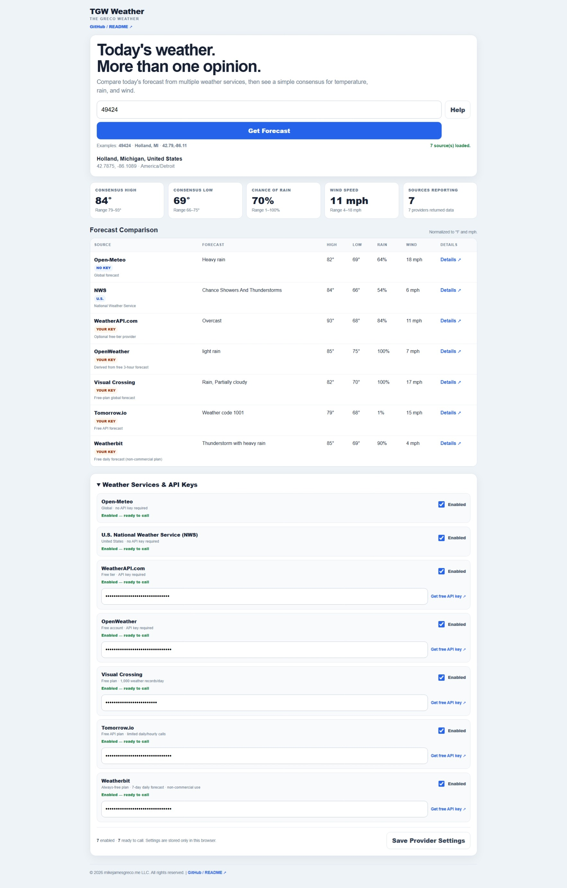

# TGW Weather

**The Greco Weather**

TGW Weather is a lightweight, browser-based weather comparison workspace that queries multiple forecast services for the same location and presents their daily forecasts side by side.

> **Today's weather. More than one opinion.**

Rather than trying to create another weather forecast, TGW Weather is designed to **compare forecasts**. It shows the individual provider values along with a simple consensus for high temperature, low temperature, chance of rain, and wind speed.

## Live Application

**Launch TGW Weather:**  
https://mikejamesgreco.github.io/tgw-weather/

## Screenshot

Add a repository screenshot as:

```text
screenshot.jpeg
```

Then enable the image below:

```markdown

```

## What TGW Weather Does

TGW Weather accepts a location such as:

- ZIP or postal code
- City and state
- Latitude and longitude

It resolves the location to coordinates and asks each enabled weather provider for the same general forecast location.

The application then displays:

- Provider forecast description
- Daily high temperature
- Daily low temperature
- Chance of rain
- Wind speed
- Provider-specific details link
- Consensus high
- Consensus low
- Consensus rain chance
- Consensus wind speed
- Provider ranges for the consensus values
- Number of providers reporting

The consensus values are simple arithmetic averages of the providers that successfully return each metric. The displayed range helps show how closely the providers agree.

## Weather Providers

TGW Weather currently supports these providers:

| Provider | API Key | Notes |
| --- | --- | --- |
| Open-Meteo | No | Global forecast data |
| U.S. National Weather Service | No | U.S. locations only |
| WeatherAPI.com | Yes | Optional personal API key |
| OpenWeather | Yes | Optional personal API key |
| Visual Crossing | Yes | Optional personal API key |
| Tomorrow.io | Yes | Optional personal API key |
| Weatherbit | Yes | Optional personal API key |

Each provider can be individually enabled or disabled.

Keyed providers are called only when the provider is enabled **and** a key has been supplied.

Free plans, quotas, licensing terms, and API availability can change. Check each provider's current terms before relying on a service for production or commercial use.

## API Keys

TGW Weather does not ship with shared API credentials.

Users can enter their own API keys for supported services. Provider choices and keys are stored in the browser using `localStorage`.

Because TGW Weather is a browser application, JavaScript must be able to read a saved key in order to send it to the corresponding weather provider. Users should treat those keys as browser-accessible credentials and follow each provider's guidance.

Signup and documentation links are available directly in the application.

## Provider Settings

The **Weather Services & API Keys** section shows the status of each service:

- **Enabled — ready to call**
- **Enabled — add an API key to include this source**
- **Disabled — will not be called**

The settings summary shows how many services are enabled, ready, or waiting for an API key.

Click **Save Provider Settings** to store the current configuration in the browser.

## Local-First Design

TGW Weather is part of the **SFLA — Single-File Local Application** family.

The application itself is a standalone HTML file with no required JavaScript framework or package manager.

Forecast requests are made directly from the browser to the enabled public weather APIs.

The application can be:

- Hosted with GitHub Pages
- Opened directly as a local HTML file where browser/API policies permit
- Copied as a single application file

## Repository Files

A minimal repository can look like:

```text
tgw-weather/
│
├── index.html
├── tgw-weather.html
├── screenshot.jpeg
├── README.md
└── LICENSE
```

### `index.html`

GitHub Pages entry point. It redirects to the stable application filename.

### `tgw-weather.html`

The complete standalone TGW Weather application.

The filename intentionally does not contain a release number. The application version is maintained internally through the single `APP_VERSION` JavaScript variable and is shown from the Help page rather than the main application surface.

## Help

The application includes embedded Help covering:

- Forecast consensus
- Supported providers
- API keys
- Saved settings
- Location input
- Differences between provider forecasts
- Privacy and local-first behavior
- Current application version
- GitHub documentation

## Why Compare Forecasts?

Weather providers may differ because of their underlying forecast models, update times, geographic grids, post-processing, and interpretation.

A single average should not hide that disagreement, so TGW Weather presents both the individual forecasts and the aggregate consensus/range.

## Design Goals

TGW Weather follows the same general SFLA principles as the other Greco browser tools:

- Small and understandable
- Browser-native
- Minimal dependencies
- Local-first configuration
- No build system required for normal use
- Easy to copy, host, inspect, and modify
- Useful immediately after opening

## Related SFLA Projects

- **TGG Grid — The Greco Grid**  
  https://mikejamesgreco.github.io/tgg-grid/

- **TGDS Data Scope — The Greco Data Scope**  
  https://mikejamesgreco.github.io/tgds-scope/

- **TGJVM Monitor — The Greco JVM Monitor**  
  https://mikejamesgreco.github.io/tgjvm-monitor/

- **SFLA Home**  
  https://mikejamesgreco.github.io/

## License

Add the license you want to use for the repository in `LICENSE`.

---

© mikejamesgreco.me LLC. All rights reserved.
